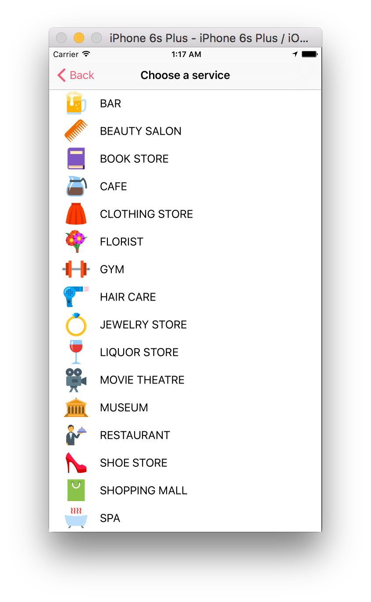

# MothersDayPlanner

<p align="center">




</p>


## Requirements

- iOS 9.2+ / Mac OS X 10.9+
- Xcode 7.3+

## Installation

### CocoaPods

[CocoaPods](http://cocoapods.org) is a dependency manager for Cocoa projects. You can install it with the following command:

```bash
$ gem install cocoapods
```

> CocoaPods 0.39.0+ is required to build GIFSearcher

To launch MothersDayPlanner project in your Xcode using CocoaPods, navigate to project directory and run the following command:

```bash
$ pod install
```
---

## Libraries used

- GoogleMaps

## License

MothersDayPlanner is released under the MIT license. See LICENSE for details.
